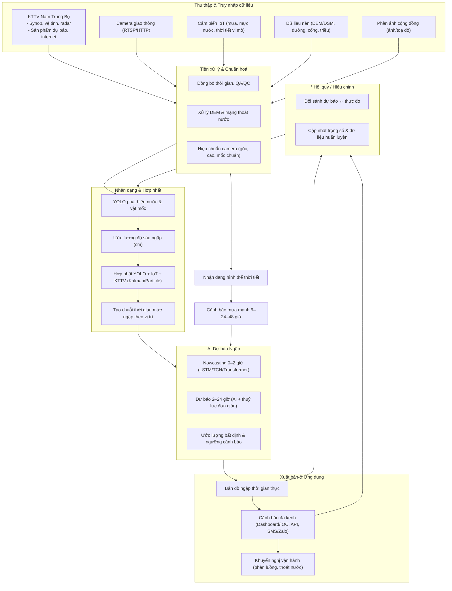

# Quy trình lập bản đồ ngập lụt đô thị (ứng dụng cho Đà Nẵng, có hỗ trợ YOLO & AI cảnh báo)



## 1) Mục tiêu & phạm vi

* Xây dựng lớp **bản đồ hiện trạng & nguy cơ ngập** theo tuyến đường/khu dân cư.
* Vận hành **giám sát thời gian thực** và **cảnh báo sớm** theo ngưỡng.
* Phạm vi: toàn TP. Đà Nẵng; ưu tiên các “điểm đen” ngập lịch sử.

## 2) Dữ liệu đầu vào

* **Nền địa lý – hạ tầng**: DEM/DSM, mạng lưới đường, cống/rãnh, sông–kênh, ranh phường/xã, sử dụng đất.
* **Khí tượng – thủy văn**: mưa (trạm/phút–giờ), triều, mực nước sông/kênh/cống; (nếu có) radar/satellite mưa.
* **Quan trắc IoT**: cảm biến mực nước mặt đường/cống, trạm thời tiết vi mô.
* **Camera giao thông + YOLO** (điểm thay thế/hỗ trợ mới):

  * Luồng video RTSP/HTTP từ camera giao thông hiện hữu.
  * Mô hình YOLO (fine-tune theo dữ liệu địa phương) phát hiện **vùng nước/độ ngập tương đối**, trích xuất **chỉ số mức ngập quy đổi (cm)** dựa vật mốc (lề đường, bánh xe, cọc chuẩn) và hiệu chuẩn camera.
* **Phản ánh cộng đồng**: ảnh/toạ độ/mức ngập ước lượng qua ứng dụng.

## 3) Tiền xử lý & chuẩn hoá

* **Chuẩn hoá toạ độ, thời gian** (NTP), chất lượng dữ liệu (QA/QC), loại bỏ nhiễu cảm biến.
* **Xử lý DEM**: lấp hố, hiệu chỉnh theo cao độ chuẩn, trích **hướng thoát nước bề mặt**.
* **Hiệu chuẩn camera**: chiều cao đặt, tiêu cự, góc nhìn; gắn **mốc chuẩn** tại hiện trường để quy đổi pixel → cm cho YOLO.
* **Tổng hợp thời tiết**: mưa tích luỹ 5/15/60 phút, chỉ số IDF phục vụ kịch bản.

## 4) Suy diễn mức ngập từ YOLO (hỗ trợ thay thế đo mực nước tại mặt đường)

1. **Nhận dạng nước mặt đường** (YOLO) và vật mốc trong khung hình.
2. **Ước lượng độ sâu tương đối** theo lề/vành bánh/cọc (bảng mốc chuẩn).
3. **Quy đổi độ sâu (cm)** bằng **ma trận hiệu chuẩn camera** + hình học ảnh.
4. **Theo dõi theo thời gian** để tạo **chuỗi thời gian mức ngập** cho từng điểm camera.
5. **Hợp nhất với IoT** bằng lọc Kalman/particle để tăng độ tin cậy.

*Kết quả*: lớp điểm/thửa đường có **mức ngập theo thời gian** (cm, độ tin cậy) phục vụ bản đồ hiện trạng & kiểm định mô hình.

## 5) Mô phỏng – phân tích ngập (tùy mức chi tiết)

* **Tuyến nhanh dữ liệu (data-driven)**: suy luận “bề mặt ngập” từ DEM + mạng thoát nước + **trường mức ngập quan sát** (YOLO/IoT) bằng nội suy ràng buộc địa hình.
* **Tuyến lai đơn giản (hydraulic-light)**: mô hình khái niệm lưu lượng–khả năng thoát theo ô/đoạn đường; biên mưa–triều; hiệu chỉnh bằng chuỗi mức ngập YOLO/IoT.

## 6) Biên soạn bản đồ

* **Bản đồ hiện trạng ngập** theo thời điểm (10’, 30’, 60’).
* **Bản đồ nguy cơ/nhạy cảm**: 5 mức (không, <10 cm, 10–25, 25–40, >40 cm).
* **Bản đồ “điểm đen” & nút giao rủi ro** theo tần suất vượt ngưỡng.
* Xuất: raster (GeoTIFF/tiles), vector (GeoJSON), dịch vụ WMS/XYZ.

## 7) Hệ thống dự báo & cảnh báo (AI là thành phần trung tâm)

* **Nowcasting 0–2 giờ**: LSTM/TCN/Transformer dùng mưa, triều, mức ngập YOLO/IoT, đặc trưng địa hình–thoát nước.
* **Dự báo 2–24 giờ**: mô hình lai (AI + quan hệ dòng chảy đơn giản), **online learning**.
* **Ước lượng bất định**: dải tin cậy để đặt **ngưỡng cảnh báo** theo đường/khu vực & giờ.
* **Cảnh báo đa kênh**: dashboard, API cho IOC/CSGT, SMS/Zalo, widget hành trình.

## 8) Kiểm định – hiệu chỉnh

* **YOLO**: mAP/IoU (class “nước”), MAE độ sâu (cm) vs mốc/IoT.
* **Bản đồ ngập**: so chồng với ảnh hiện trường/sự kiện điển hình.
* **Dự báo**: MAE/RMSE (1/3/6/24h), Brier score.
* **Cải tiến**: mở rộng dữ liệu (đêm/mưa lớn/chói), re-finetune định kỳ.

## 9) Xuất bản & vận hành

* **WebGIS thời gian thực**: lớp mức ngập, icon camera (snapshot), lớp cảm biến, tuyến tránh ngập.
* **API/Open Data**: mức ngập dự báo theo toạ độ/đoạn đường; webhook cảnh báo.
* **SLA dữ liệu**: độ trễ mục tiêu < **60 s** từ camera/IoT đến bản đồ; lưu chuỗi thời gian phục vụ phân tích.

## 10) Tổ chức & trách nhiệm


## 11) Lộ trình khuyến nghị

* **Pha 1 (0–3 tháng)**: 50–100 camera trọng điểm, mốc chuẩn; POC YOLO đo độ sâu; dashboard hiện trạng.
* **Pha 2 (4–8 tháng)**: 200+ camera / 100+ cảm biến; AI nowcasting ổn định; cảnh báo đa kênh; tích hợp IOC.
* **Pha 3 (9–12 tháng)**: dự báo 24h; API mở; tối ưu tuyến giao thông trong mưa; báo cáo KPI.

---

## YOLO Detection

Một mô hình AI để phát hiện diện tích và mức nước ngập thời gian thực, phục vụ cảnh báo và phân tích.

### Mô tả dự án

Dự án huấn luyện mô hình **YOLOv8n** tùy chỉnh trên dataset [Water Segmentation (Kaggle)](https://www.kaggle.com/datasets/gvclsu/water-segmentation-dataset) cộng thêm dữ liệu tự gán nhãn (Roboflow). Mục tiêu: phát hiện vùng nước trong ảnh/video **nhanh** và **chính xác**.
Mô hình `flood-v7.pt` đã được huấn luyện sẵn và cung cấp trong repo.

### Cách xác định mức nước

Ngoài phát hiện vùng nước, cần thêm:

* Tọa độ hai điểm của **đường đo** vuông góc mặt nước.
* **Pixels-per-meter** để quy đổi ảnh → thực tế.
* **Chiều cao thực tế** của điểm mốc và **ngưỡng cảnh báo**.

*Hình minh hoạ:* `media/a1.png`

### Yêu cầu môi trường

* Python 3.11.3
* PIP 23.1.2
* Thư viện: Ultralytics YOLOv8, Tkinter (GUI), Shapely (hình học)

### Quy trình huấn luyện

```bash
yolo task=detect mode=train model=yolov8n.pt data=custom_data.yaml epochs=100 imgsz=640 batch=16
```

Theo dõi loss, precision, recall, mAP; lưu mô hình tốt nhất `flood-v7.pt`.

### Giới hạn & hướng phát triển

* Hiện tối ưu cho **một vùng nước/khung hình**; sẽ mở rộng đa vùng.
* Xử lý giao điểm đường đo ↔ mask khi nhiều giao cắt còn hạn chế; sẽ cải tiến.

---

## Xây dựng mô hình AI phục vụ dự báo ngập lụt đô thị

### 1. Thu thập & chuẩn bị dữ liệu

* Camera giao thông/giám sát; IoT (mưa, mực nước, lưu lượng, gió…); lịch sử ngập; địa hình; thoát nước; dự báo mưa radar, v.v.
* Chuẩn hoá, gán nhãn, tách train/val/test.

### 2. Huấn luyện mô hình

* YOLO cho nhận dạng nước; LSTM/TCN/Transformer/RandomForest/XGBoost cho dự báo chuỗi thời gian.
* Đánh giá: mAP (nhận dạng), RMSE/MAE (dự báo), F1/Precision/Recall.

### 3. Lập kịch bản dự báo & cảnh báo

* Ghép dự báo mưa + mức ngập YOLO/IoT để mô phỏng các kịch bản (mưa lớn, triều cường, kết hợp).
* Kết quả: thời gian, vị trí, mức độ, kéo dài; kích hoạt cảnh báo theo **ngưỡng**; bảng điều khiển & bản đồ tương tác.

### 4. Thử nghiệm & triển khai

* Thử nghiệm thực địa, đối chiếu quan sát; triển khai on-prem/cloud; tích hợp cảnh báo (app, Zalo, SMS).

